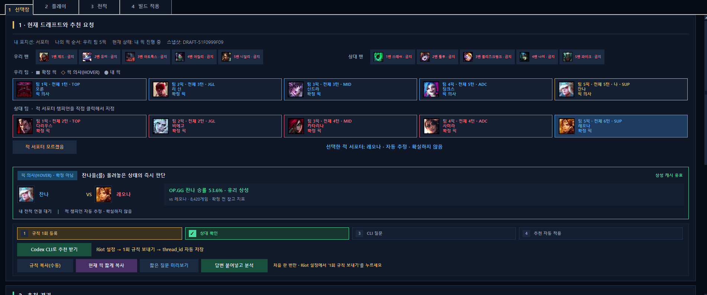
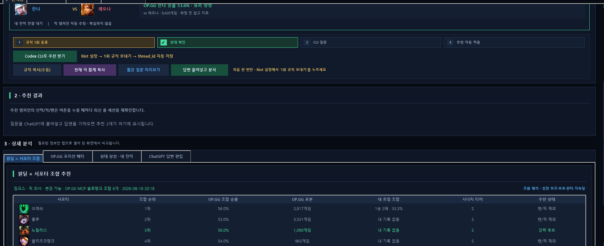
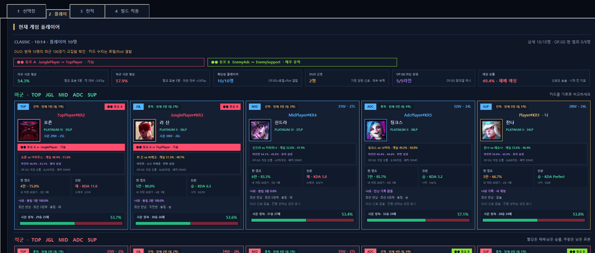
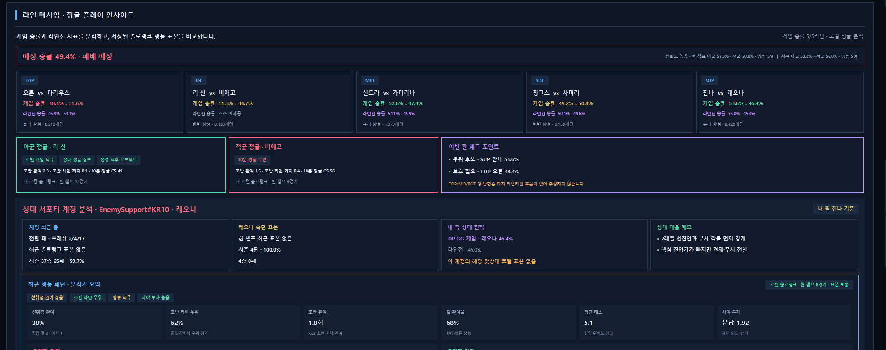
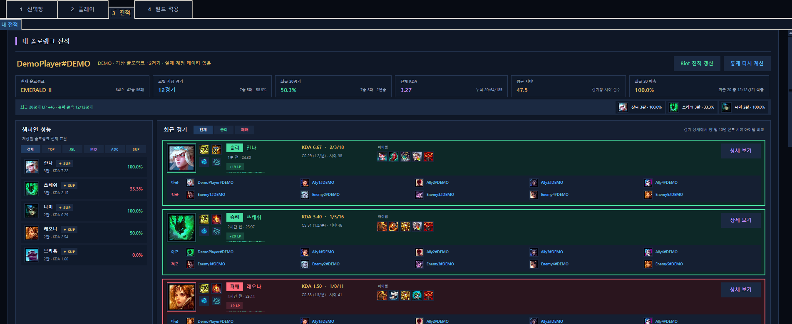
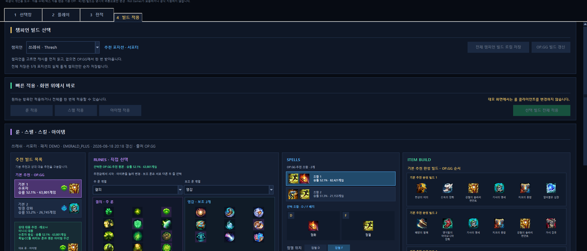

# LOL Support Advisor

[한국어](#한국어) · [English](#english)

## 한국어

Windows용 리그 오브 레전드 픽·전적·빌드 보조 데스크톱 앱입니다. 챔피언 선택부터 게임 전 플레이어 분석, 로컬 전적, 룬·스펠·아이템 적용까지 한 화면에서 확인할 수 있습니다.

> [!IMPORTANT]
> Riot Games가 제작·보증·지원하는 공식 제품이 아닙니다. League Client의 비공식 LCU와 공개 웹페이지 구조를 사용하는 기능은 클라이언트 또는 사이트 업데이트 후 일시적으로 동작하지 않을 수 있습니다.



위 화면과 아래 스크린샷은 모두 `--demo`에서 만든 **가상 데이터**입니다. 실제 Riot ID, 전적, API 키 또는 Codex 대화 정보가 포함되지 않습니다.

## Windows EXE 다운로드

[최신 GitHub Release](https://github.com/wolstar415/lol-support-advisor/releases/latest)에서 `LOL-Support-Advisor-v*.exe`를 내려받아 바로 실행할 수 있습니다. EXE 버전은 Python을 별도로 설치할 필요가 없습니다.

- 실행 파일 옆의 `data` 폴더에 설정, 이미지 캐시, 전적 DB가 저장됩니다.
- 프로젝트는 코드 서명 인증서가 없는 개인 프로젝트이므로 Windows SmartScreen 경고가 나타날 수 있습니다.
- 릴리스에 함께 첨부된 `SHA256SUMS.txt`로 파일 해시를 확인할 수 있습니다.

## 주요 화면

| 화면 | 주요 기능 |
| --- | --- |
| **선택창** | 내 포지션·픽 순서·HOVER·확정 픽·양 팀 밴 감지, 상대 지정, OP.GG 메타·상성 비교, 선택적으로 Codex 추천 3개 |
| **플레이** | 아군/적군 10명 카드, 시즌 전적·최근 폼·전판 KDA, 라인 상성, 듀오 추정, 예상 승패와 대응 분석 |
| **전적** | 내 솔로랭크 최대 1,000경기 로컬 분석, 최근 20경기·챔피언별 성능·예측 적중, 타인 전적 10경기 단위 조회 |
| **빌드 적용** | 포지션과 상대에 맞는 룬·스펠·스킬·아이템 빌드, 표본·승률 비교, League Client에 항목별 적용 |

### 추천 결과와 상세 분석



현재 원딜과의 조합, 포지션 메타, 상대 상성, 내 로컬 전적을 화면 아래의 세부 탭에서 비교합니다. 설정에서 기본 OFF인 **픽 추천 사용 (Codex CLI)**을 허용하면 현재 역할군과 픽·밴·HOVER를 반영한 추천 챔피언 3개가 표시됩니다.

### 플레이어 비교



같은 듀오로 추정된 플레이어는 동일한 그룹 색으로 표시합니다. 라인별 게임 승률·라인전 지표, 최근 폼과 예상 승패도 한 화면에서 비교할 수 있습니다.

### 라인 매치업과 플레이 인사이트



게임 승률과 라인전 지표를 분리해 보여주고, 내 맞상대의 최근 폼·숙련도·행동 성향과 이번 판 체크 포인트를 함께 정리합니다. 표본이 없거나 신뢰할 수 없는 값은 추측해 채우지 않습니다.

### 솔로랭크 전적



승리와 패배를 카드 색으로 구분하고 최근 20경기, LP 변화, 예측 적중, 챔피언별 성능을 함께 표시합니다. 데모 전적은 모두 가상 경기입니다.

### 빌드 선택과 적용



추천 룬과 소환사 주문 조합의 승률·게임 수를 비교하고, 룬·스펠·아이템을 원하는 항목만 League Client에 적용할 수 있습니다.

## 핵심 기능

- 실행 중인 League Client에서 픽·밴·포지션·픽 순서 교환을 실시간 감지
- OP.GG 메타, 챔피언 상성, 원딜×서포터 조합, 룬·스펠·아이템 빌드를 로컬 캐시 우선으로 표시
- 설정에서 허용한 경우에만 Codex CLI 대화를 사용해 TOP/JGL/MID/ADC/SUP 역할별 추천 챔피언 3개 생성
- 플레이어 10명의 시즌 전적, 최근 폼, 현재 챔피언 표본, 나와 만난 기록을 카드로 비교
- 최근 공통 경기로 듀오 가능성을 추정하고 같은 듀오 쌍을 동일한 색으로 표시
- 내 전적은 최대 1,000경기를 SQLite에 누적하고, 다른 플레이어는 10경기씩 필요할 때만 조회
- 룬·스펠·아이템을 각각 적용하거나 선택한 빌드를 한 번에 적용
- 챔피언·아이템·룬 이미지를 로컬에 저장해 다음 실행과 탭 이동을 빠르게 처리
- 자동 수락은 1.3~2.2초의 짧은 지연 뒤 실행되고, 사용자 지정 챔피언 자동 밴과 함께 기본값은 `OFF`
- 닷지 후 이전 픽·밴 화면을 즉시 비우며, 선택 설정으로 자동 게임찾기도 중단
- 설정에서 한국어와 English 화면 언어를 선택하고 다음 실행에도 유지

## 빠른 시작

### 요구 사항

- Windows 10 또는 Windows 11
- Python 3.11 이상
- League of Legends 클라이언트
- 전적 기능 사용 시 [Riot Developer Portal](https://developer.riotgames.com/) API 키
- AI 추천 사용 시 로그인된 Codex CLI — 선택 사항

Python 외 별도 런타임 패키지는 필요하지 않습니다.

### 설치 및 실행

```powershell
git clone https://github.com/wolstar415/lol-support-advisor.git
cd lol-support-advisor
python app.py
```

Windows에서는 `run.bat`을 더블클릭해도 됩니다. 콘솔 없는 `pythonw.exe`로 실행되므로 배치 창이 남지 않습니다.

### 개인정보 없는 데모

```powershell
python app.py --demo
```

또는 `run_demo.bat`을 실행합니다. 데모 모드는 매번 별도의 임시 SQLite DB를 만들며 다음 데이터를 읽지 않습니다.

- `data/advisor.db`의 실제 전적과 플레이어 캐시
- Riot API 키와 저장 시각
- Codex `thread_id`
- 자동 수락·자동 밴 등 실제 사용자 설정

데모가 일반 앱과 공유하는 것은 챔피언·아이템·룬 같은 정적 이미지 캐시뿐입니다. 화면의 Riot ID, 승패, KDA, LP, 듀오, 상성, 추천 빌드는 모두 코드에 포함된 예시값입니다.

데모 스크린샷을 위해 Codex 추천 화면은 표시하지만 실제 Codex CLI 전송, LCU 작업, 자동 수락과 자동 밴은 모두 차단됩니다.

## 처음 설정하기

1. 앱 상단의 **Riot 설정**을 엽니다.
2. **화면 언어**에서 `한국어` 또는 `English`를 고릅니다. 저장 즉시 적용되며 다음 실행에도 유지됩니다.
3. Riot Developer Portal에서 발급한 개발용 API 키를 입력하고 저장합니다.
4. 앱이 현재 League Client의 게임 이름과 태그를 감지하고 API 키로 계정을 검증합니다.
5. AI 추천을 사용할 경우 설정에서 기본 OFF인 **픽 추천 사용 (Codex CLI)**을 켭니다. 이 설정이 꺼져 있으면 선택창의 추천 요청·결과 UI가 나타나지 않으며 CLI 전송도 차단됩니다.
6. Codex CLI에 로그인한 뒤 **1회 규칙 보내기**를 누릅니다. 새 대화가 생성되면 `thread_id`가 자동으로 저장됩니다.
7. 자동 밴을 사용할 경우 같은 설정 화면에서 원하는 챔피언을 선택합니다. 기본 선택은 럭스이며 모든 챔피언으로 변경할 수 있습니다.
8. 챔피언 선택 화면에 들어가면 앱이 픽·밴과 포지션을 감지합니다.

추천 요청은 `gpt-5.6-luna`와 최소 추론 설정을 사용하며, 1회 규칙 대화를 임시로 복제해 실행합니다. 이전 추천 답변이 기준 대화에 누적되지 않아 여러 번 요청해도 문맥이 계속 커지지 않습니다.

Riot 개발용 키는 일반적으로 약 24시간마다 갱신해야 합니다. 새 키 검증에 실패하면 기존 키를 덮어쓰지 않고 만료, 잘못된 키, 네트워크 오류를 구분해 알려줍니다.

## 기본 사용 흐름

1. **선택창**에서 내 포지션과 픽 순서를 확인합니다.
2. 상대 포지션 추정이 틀리면 상대 챔피언을 직접 선택하고, 아직 공개되지 않았다면 `모르겠음`을 선택합니다.
3. 저장된 OP.GG·개인 전적을 먼저 확인합니다. Codex 기능을 허용했다면 현재 역할군에 맞는 **Codex 픽 추천** 버튼으로 추천 3개를 생성할 수 있습니다.
4. 추천 카드의 **롤에 선택**으로 챔피언을 HOVER합니다. 픽과 밴의 최종 확정은 별도 버튼이며 실행 직전에 현재 순서·밴·보유 여부를 다시 검사합니다.
5. 게임이 시작되면 앱이 **플레이** 탭으로 이동해 10명의 정보를 순차적으로 채웁니다. 로컬 데이터는 먼저, 원격 데이터는 준비되는 대로 부분 갱신됩니다.
6. **빌드 적용**에서 추천 룬·스펠·아이템을 검토한 뒤 필요한 항목만 적용합니다.

## 데이터와 캐시

앱 데이터는 저장소의 `data/` 폴더에 보관되며 Git에서 제외됩니다.

```text
data/
├─ advisor.db       # 설정, 전적, OP.GG/플레이어 캐시
├─ icons/           # 챔피언 아이콘
├─ items/           # 아이템 아이콘과 설명
├─ runes/           # 룬 카탈로그
└─ build_assets/    # 빌드용 원격 이미지
```

- 내 솔로랭크는 Match-v5에서 최대 1,000경기를 누적하며 이미 저장된 경기 상세는 다시 받지 않습니다.
- 다른 플레이어 전적은 첫 10경기만 받고 **10경기 더 불러오기**를 누를 때 다음 10경기를 요청합니다.
- 타인 전적·프로필 캐시는 마지막 갱신 후 1일이 지나면 삭제하고 내 전적은 유지합니다.
- OP.GG·빌드·상성 등 같은 요청의 재사용 시간은 설정에서 변경할 수 있습니다.
- 오래된 로컬 데이터가 있으면 즉시 보여주고, 쿨타임이 지난 경우에만 백그라운드 갱신합니다.
- 경기별 LP는 경기 전후 League-v4 상태를 한 경기에 안전하게 연결할 수 있을 때만 표시합니다. 판단할 수 없는 경기는 임의의 LP를 만들지 않습니다.

> [!CAUTION]
> Riot API 키와 Codex `thread_id`는 로컬 SQLite에 평문으로 저장됩니다. `data/` 폴더, DB 파일, 로그 또는 실제 계정이 보이는 스크린샷을 공개 저장소에 올리지 마세요.

## 자동화와 안전장치

- 자동 수락과 사용자 지정 자동 밴은 기본 `OFF`이며 사용자가 켠 경우에만 동작합니다.
- 자동 밴은 설정에서 고른 챔피언을 대상으로 실제 `BAN_PICK` 단계와 내 밴 차례를 확인한 뒤 수행합니다.
- 픽 추천은 기본 `OFF`이며, **픽 추천 사용 (Codex CLI)** 설정을 켰을 때만 UI와 전송 기능이 활성화됩니다.
- AI 추천의 자동 HOVER는 픽을 확정하지 않으며 사용자가 언제든 변경할 수 있습니다.
- 픽·밴·빌드 적용은 실행 직전에 최신 챔피언 선택 세션을 다시 검사합니다.
- 실패하면 자동으로 반복 확정하지 않고 League Client에서 직접 처리하도록 안내합니다.
- 스킬 순서는 참고용이며 게임 중 키 입력이나 자동 스킬 레벨업은 수행하지 않습니다.

LCU는 Riot이 제3자용으로 안정성을 보장하는 공개 API가 아닙니다. 실제 게임에서는 항상 League Client 화면을 함께 확인하세요.

## 알려진 제약

- OP.GG는 이 앱이 사용하는 공개 집계 API를 제공하지 않으므로 웹페이지 형식이 바뀌면 갱신이 실패할 수 있습니다. 파싱에 실패하면 임의 수치를 표시하지 않고 마지막 정상 캐시를 유지합니다.
- Live Client API에는 공식 파티 ID가 없어 듀오 표시는 최근 공통 경기 기반의 **추정값**입니다.
- 개발용 Riot API 키는 호출량과 유효기간 제한이 있습니다. 대량 전적의 최초 동기화에는 시간이 걸릴 수 있습니다.
- 자동화 또는 LCU 기능은 League Client 패치 후 일시적으로 동작하지 않을 수 있습니다.

## 테스트

```powershell
python -m unittest discover -s tests -v
```

테스트는 캐시·전적 분석·OP.GG 파싱·LCU 작업 검증·듀오/예측 로직·UI 부분 갱신 회귀를 포함합니다.

## 프로젝트 구조

```text
lol-support-advisor/
├─ app.py
├─ lol_support_advisor/
│  ├─ ui.py           # Tk GUI와 화면 상태
│  ├─ lcu.py          # League Client 로컬 작업
│  ├─ auto_ban.py     # 자동 밴 타이머·실행 시점 계산
│  ├─ riot_api.py     # Riot API 동기화
│  ├─ opgg.py         # OP.GG 메타·빌드 파싱
│  ├─ storage.py      # SQLite 캐시
│  └─ ...
├─ tests/
├─ docs/images/       # 개인정보 없는 데모 스크린샷
├─ run.bat
└─ run_demo.bat
```

## 고지

LOL Support Advisor는 개인 프로젝트이며 Riot Games와 제휴하지 않습니다. League of Legends와 관련 로고·이미지·게임 자산은 Riot Games, Inc.의 상표 또는 저작물입니다. 공개 배포 또는 기능 확장 전에는 Riot Games의 최신 개발자 정책을 직접 확인하세요.

---

## English

LOL Support Advisor is a Windows desktop companion for League of Legends draft decisions, live-game player analysis, match history, and build application.

Choose **English** under **Riot Settings → Display language** to switch the application UI. The choice is saved locally and restored on the next launch.

> [!IMPORTANT]
> This is not an official Riot Games product and is not endorsed or supported by Riot Games. Features based on the unofficial League Client API (LCU) or public website markup may temporarily stop working after a client or website update.


Every screenshot in this README was captured with `--demo`. It contains fictional data only—no real Riot ID, match history, API key, or Codex conversation data.

### Download the Windows EXE

Download `LOL-Support-Advisor-v*.exe` from the [latest GitHub Release](https://github.com/wolstar415/lol-support-advisor/releases/latest) and run it directly. The packaged EXE does not require a separate Python installation.

- Settings, image caches, and the match database are stored in a `data` folder beside the executable.
- This personal project is not code-signed, so Windows SmartScreen may show a warning.
- Use the accompanying `SHA256SUMS.txt` to verify the downloaded file.

### Main screens

| Screen | What it provides |
| --- | --- |
| **Draft** | Detects your role, pick order, HOVER, locked picks, and both teams' bans; compares OP.GG meta and matchups; optionally shows three Codex recommendations |
| **Live Game** | Ten player cards, season record, recent form, previous-game KDA, lane matchups, duo estimates, predicted outcome, and matchup notes |
| **Match History** | Up to 1,000 of your Solo Queue matches stored locally, last-20 summary, champion performance, prediction accuracy, and on-demand 10-match pages for other players |
| **Apply Build** | Position- and matchup-aware runes, spells, skill order, and item builds with sample size and win rate; applies selected components to the League Client |

#### Recommendations and draft analysis


Compare bot-lane synergy, position meta, enemy matchups, and your local record in compact detail tabs. Codex recommendations are disabled by default and appear only after you explicitly enable **Pick recommendations (Codex CLI)** in Settings.

#### Live player comparison


Players estimated to be a duo share the same group color. The board also separates lane win rate from game win rate and progressively fills recent-form and prediction data without rebuilding the full screen.

#### Matchups and live insights


The insight area combines lane matchup data, the direct opponent's recent form and champion experience, behavior signals, and practical checkpoints. Missing or unreliable samples are shown as unavailable rather than guessed.

#### Solo Queue history


Win and loss cards use distinct colors. The page includes last-20 performance, safely observed LP changes, prediction accuracy, and per-champion results. All demo matches are fictional.

#### Build selection and application


Compare rune pages and summoner-spell combinations by games and win rate, then apply runes, spells, items, or the complete selected build to the League Client.

### Highlights

- Live detection of picks, bans, roles, and accepted pick-order swaps
- Local-cache-first OP.GG meta, champion matchups, ADC × support synergy, and build data
- Optional Codex CLI recommendations for TOP, JGL, MID, ADC, and SUP; disabled by default
- Ten-player comparison with season record, recent form, champion sample, and prior encounters
- Duo estimation from shared recent matches, with a stable color shared by each pair
- Up to 1,000 of your own Solo Queue matches; other players are fetched only in pages of 10
- Independent rune, spell, and item application, or one-click application of the selected build
- Locally cached champion, item, and rune images for faster launches and tab changes
- Auto-accept waits a short 1.3–2.2 seconds; auto-accept and user-selected auto-ban are disabled by default
- Draft state is cleared after a dodge, with an optional setting to stop matchmaking
- Korean and English UI selectable from Settings

### Requirements

- Windows 10 or Windows 11
- Python 3.11 or newer
- League of Legends client
- A [Riot Developer Portal](https://developer.riotgames.com/) API key for match-history features
- A signed-in Codex CLI for optional AI recommendations

The application has no required third-party Python runtime package.

### Install and run

```powershell
git clone https://github.com/wolstar415/lol-support-advisor.git
cd lol-support-advisor
python app.py
```

On Windows, you can also double-click `run.bat`. It launches through `pythonw.exe`, so no command window remains open.

### Privacy-safe demo

```powershell
python app.py --demo
```

You can also run `run_demo.bat`. Demo mode creates a new temporary SQLite database for every launch and never reads:

- real match or player caches from `data/advisor.db`
- the Riot API key or its saved timestamp
- the Codex `thread_id`
- real auto-accept, auto-ban, or recommendation settings

Only static champion, item, and rune image caches are shared with the normal application. Riot IDs, results, KDA, LP, duo groups, matchups, and builds shown in demo mode are bundled fictional examples. Codex transmission and all LCU write actions are blocked in demo mode.

### First-time setup

1. Open **Riot Settings** from the top bar.
2. Select **English** under **Display language** if desired, then save.
3. Enter a development API key issued by the Riot Developer Portal.
4. The app detects your Riot game name and tag from the running League Client and validates the key before replacing a saved key.
5. To use AI recommendations, enable **Pick recommendations (Codex CLI)**. When disabled, the request/result UI is hidden and CLI transmission is blocked.
6. Sign in to Codex CLI and select **Send one-time instructions**. A new `thread_id` is filled and saved automatically when the field is empty.
7. To use auto-ban, select any champion in the same Settings dialog. Lux is only the default selection.

Recommendation requests use `gpt-5.6-luna` with minimal reasoning. Each request forks the one-time instruction conversation, so recommendation replies do not continuously enlarge the baseline context.

Riot development API keys generally need to be renewed about every 24 hours. If validation fails, the app keeps the previous key and distinguishes expiration, an invalid key, and a network error.

### Typical workflow

1. Confirm your position and pick order on **Draft**.
2. Correct the inferred enemy role manually, or select **Unknown** before it is revealed.
3. Review cached OP.GG and personal statistics first. If Codex recommendations are enabled, request three suggestions for the current role.
4. Use **Select in League** to HOVER a suggestion. Locking a pick or ban is a separate action and revalidates turn, bans, and champion availability immediately before the write.
5. When the game starts, **Live Game** opens and fills ten player cards progressively—local data first, remote data when ready.
6. Review and apply only the needed rune, spell, or item components under **Apply Build**.

### Data and cache behavior

Application data is stored under the repository's ignored `data/` directory:

```text
data/
├─ advisor.db       # settings, matches, and OP.GG/player caches
├─ icons/           # champion icons
├─ items/           # item icons and descriptions
├─ runes/           # rune catalog
└─ build_assets/    # remote build images
```

- Your Solo Queue history accumulates up to 1,000 Match-v5 games; already stored match details are not downloaded again.
- Another player's history starts with 10 matches and requests another 10 only when you press **Load 10 more matches**.
- Other-player match/profile caches are deleted one day after their last refresh; your own history is retained.
- Reuse intervals for OP.GG, matchup, build, and player-analysis requests can be changed in Settings.
- Stale local data is displayed immediately and refreshed in the background only after its cooldown expires.
- Per-match LP is shown only when before/after League-v4 states can be linked safely to exactly one match. Unknown LP is never fabricated.

> [!CAUTION]
> The Riot API key and Codex `thread_id` are stored as plain text in the local SQLite database. Never publish `data/`, database files, logs, or screenshots containing a real account.

### Automation and safety

- Auto accept and user-selected auto ban are disabled by default.
- Auto ban verifies the real `BAN_PICK` phase and the local player's ban turn before acting.
- AI recommendation UI and transmission exist only when explicitly enabled in Settings.
- Automatic recommendation HOVER never locks the pick and can be changed by the user.
- Pick, ban, rune, spell, and item writes re-check the newest League Client state immediately before execution.
- A failed write does not repeatedly force the action; the UI tells the user to complete it in the League Client.
- Skill order is reference-only. The app does not press in-game keys or level skills automatically.

LCU is not a stable public third-party API guaranteed by Riot. Keep the League Client visible when using automation in a real draft.

### Known limitations

- OP.GG does not provide the public aggregate API required by this app. A markup change can break refreshes; the app keeps the last valid cache instead of inventing values.
- The Live Client API exposes no official party ID, so duo badges are estimates based on shared recent matches.
- Development Riot API keys have strict rate and lifetime limits. A first-time history sync can take time.
- League Client patches can temporarily break LCU automation.
- If the League Client never exposes hidden Riot IDs, the app cannot bypass that privacy restriction. It can retain IDs only when the client legitimately reveals them during the same loading session.

### Tests

```powershell
python -m unittest discover -s tests -v
```

The suite covers caching, history analysis, OP.GG parsing, LCU action validation, duo and prediction logic, privacy-safe live identity capture, and partial-render performance regressions.

### Disclaimer

LOL Support Advisor is a personal project and is not affiliated with Riot Games. League of Legends and related logos, images, and game assets are trademarks or copyrighted works of Riot Games, Inc. Review the latest Riot Games developer policies before public distribution or major feature expansion.
